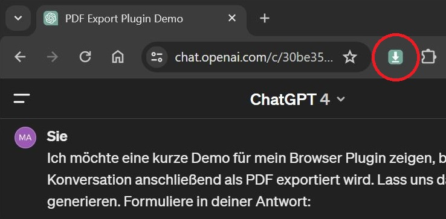

# Open-ChatGPT-Exporter

> [!CAUTION]
> Aufgrund neuster Anpassungen von OpenAI ist das Plugin nicht mehr funktionsfähig. Ich plane derzeit keine Aktualisierung.

Open-ChatGPT-Exporter ist eine Google Chrome Erweiterung, zum Export von ChatGPT Konversationen. Durch einen Klick auf das Icon wird die aktiv geöffnete Konversation um alle Steuerelemente bereinigt und als .html Datei heruntergeladen. In dieser Form kann die Konversation lokal gespeichert, durchsucht oder einfach als PDF exportiert werden. Das ist besonders praktisch, wenn du eine informationsreiche Konversation mit anderen teilen möchtest. Zum jetzigen Zeitpunkt bietet OpenAI keine native Möglichkeit, GPT4 Konversationen mit nichtzahlenden Usern zu teilen.



## Datensicherheit

Anders als bei öffentlichen Lösungen im Google Chrome Store, bleiben deine Daten deine Daten. Der Open-ChatGPT-Exporter arbeitet 100 % lokal und sendet weder Daten an einen Server, noch speichert er Informationen lokal.

## Strategie

Erst bei einem Klick auf das Erweiterungs-Icon wird der Seiteninhalt deines aktives Tabs abgerufen. Das spart Ressourcen, da das Plugin nicht durchgehend aktiv ist. Hast du gerade eine ChatGPT-Konversation geöffnet, kannst du diese nun durch einen weiteren Klick herunterladen. Hierzu werden die typischen ChatGPT Steuer- und Navigationselemente über CSS-Selktoren entfernt. Die bereinigte HTML Seite nutzt weiterhin die Stylesheets von OpenAI, für ein authentisches Look and Feel.

## Wichtiger Hinweis

Die wichtige Datensicherheit und Offline-Arbeitsweise hat jedoch auch einen Nachteil. Ändert OpenAI das Interface von ChatGPT oder seinen CSS-Klassen, kann es zu Darstellungsproblemen kommen. Ohne regelmäßige Pflege des Plugins und Updates durch die Anwender, wird es entsprechend über die Zeit zu Einschränkungen oder zum Funktionsverlust kommen.

Lass mich dir kurz zeigen wie das Plugin arbeitet. Leider hat OpenAI den Steuer- und Navigationslementen auf der Seite keine festen IDs vergeben. Das bedeutet, dass man diese anderweitig identifizieren muss. Zum jetzigen Zeitpunkt selektiere ich die Elemente über ihr Individuelles Design. Die Selektion erfolgt demnach über die Klassennamen, die OpenAI verwendet, um das entsprechende Element zu stylen.

```javascript
[
	{
		className: "sticky top-0 mb-1.5 flex items-center justify-between z-10 h-14 p-2 font-semibold bg-token-main-surface-primary",
		modify: (element) => {
			element.remove();
		},
	},
	{
		className: "fixed left-0 top-1/2 z-40",
		modify: (element) => {
			element.remove();
		},
	},
];
```

## Installation

Zum jetzigen Zeitpunkt ist die Entwicklung ein Kurzprojekt, weswegen ich nicht plane die Erweiterung im Google Chrome Store anzubieten und regelmäßig zu aktualisieren. Wenn du das Plugin dennoch nutzen möchtest, kannst du es manuell installieren.

1. Lade dazu die Erweiterung herunter oder klone am besten das GitHub Repository an einen festen Ort auf deiner Festplatte.
2. Öffne Google Chrome und navigiere zu `chrome://extensions/`.
3. Aktiviere den Entwicklermodus von Google Chrome.
4. Wähle „Entpackte Erweiterung laden“ und navigiere zu dem Ordner, in dem du das Repository gespeichert hast.
5. Selektiere den Ordner und aktiviere die Erweiterung.

## Beispiel Export

Schau dir [hier](readme/example.pdf) ein Beispiel für einen PDF Export an.


## Mach mit!

Wie du gesehen hast, werden mit Sicherheit über die Zeit Anpassungen notwendig werden. Zögere daher nicht, dich in die Weiterentwicklung einzubringen. Ob Code-Beiträge, Bug Reports oder sonstige Impulse.
